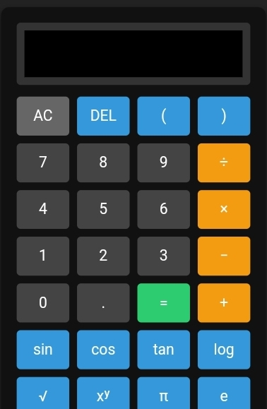

# 🧮 MS-82 Scientific Calculator

A web-based **scientific calculator** designed to mimic the **Casio MS-82** calculator. It supports basic arithmetic, trigonometric functions, logarithms, exponents, and memory functions.

## 🌟 Features
✅ **Basic Operations**: Addition (+), Subtraction (-), Multiplication (×), Division (÷)  
✅ **Trigonometric Functions**: sin, cos, tan (in degrees)  
✅ **Logarithms**: log (base 10), ln (natural log)  
✅ **Exponential & Power Functions**: x², x³, xʸ, e^x  
✅ **Square Root & Factorial**  
✅ **Pi (π) and Euler’s Number (e)**  
✅ **Memory Functions**: M+, M-, MR, MC  
✅ **Dual-line Display**: Expression & Result  

## 📸 Screenshot


---

## 🚀 Installation & Usage
open
waabiud.github.io/calculator 
or

### 1️⃣ **Download & Extract**
- Clone this repository:
  ```bash
  git clone https://github.com/waabiud/calculator.git
